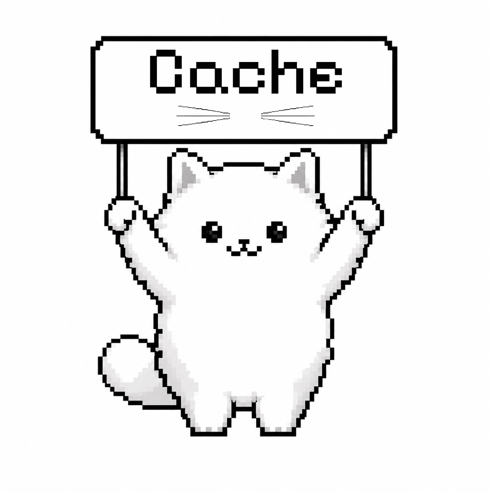
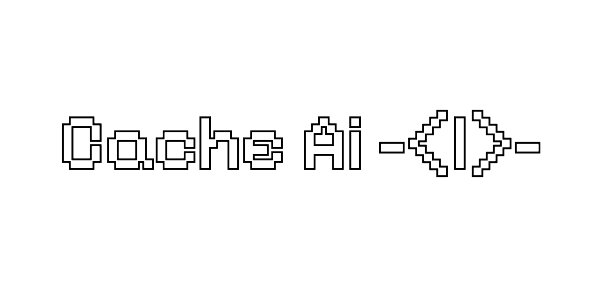

<p align="center">
  
</p>

<p align="center">
  
</p>

# Cache AI - Kitty Companion

Cache AI - Kitty Companion is a tiny Windows desktop assistant built as an Electron app. It lives on your desktop as a small pixel-art white kitty, wanders around the screen, opens a compact chat bubble when you interact with it, and answers through local AI models running on your own computer.

The goal is simple: a cute desktop companion that feels alive, stays useful, and keeps the AI work local. Cache can chat, remember small details, glance at the screen when you allow it, read visible text, watch downloads or clipboard changes when enabled, and request approval before doing desktop actions.

## What The Kitty Does

Cache appears as a small animated cat instead of a normal full-size app window. It idles, walks, reacts to hover, and can be restored with a global hotkey. The interface is intentionally compact so it feels like a companion sitting on top of Windows rather than another heavy productivity app.

The chat bubble is where the kitty talks. You can ask questions, ask what is on the screen, ask for help with files, or ask it to perform desktop tasks. When a task needs control of the computer, Cache requests approval before acting.

Cache is local-first. It talks to Ollama on `127.0.0.1:11434` and does not include a cloud API fallback. The default text model is `llama3.2:3b`, and the default vision model is `moondream`.

## First-Time Setup

Users do not need to install Ollama manually.

The Windows installer installs Cache AI. On first launch, Cache checks whether Ollama is available. If it is missing, Cache downloads the Ollama installer, installs it, starts the local Ollama service, and pulls the default models.

First launch requires an internet connection because Ollama and the model files must be downloaded. After setup finishes, normal chat and screen-analysis features run locally.

## Quick Start Tutorial

1. Go to the GitHub Releases page for this project.
2. Download the latest `CacheAI-Setup-<version>.exe` file.
3. Run the installer.
4. If Windows SmartScreen appears, choose `More info`, then `Run anyway`. This can happen for unsigned early builds.
5. Launch `Cache AI - Kitty Companion` from the Start Menu or desktop shortcut.
6. Keep the computer connected to the internet during first launch.
7. Wait while Cache checks for Ollama, installs it if needed, starts it, and downloads the default models.
8. When setup finishes, hover over the kitty to open the chat bubble.
9. Type a message and press Enter.

The first setup can take a while because model files are large. If setup fails, open the kitty settings with right-click, then press `install / repair local AI`. Make sure internet is connected and that Windows or antivirus did not block Ollama.

After the first setup, Cache uses the local models already installed on the machine. You can use normal chat features without downloading the models again.

## Features

- Pixel-art kitty desktop companion for Windows.
- Small always-on-top transparent Electron window.
- Hover-to-chat interface with lightweight conversation history.
- Local Ollama text chat using `llama3.2:3b` by default.
- Local screen description using `moondream` by default.
- First-run Ollama bootstrap so users do not manually install Ollama.
- Settings button to install or repair the local AI setup.
- Optional proactive screen glances.
- Optional clipboard watcher.
- Optional downloads watcher.
- Persistent local memory for facts, mood, reminders, and scheduled tasks.
- Approval-gated desktop actions.
- File read, file write, app opening, shell command, OCR, mouse, keyboard, and web-search permissions can be controlled separately.
- Shell command deny policy for destructive command patterns.
- Privacy mode to pause watchers.

## Local AI Models

Default models:

- Text: `llama3.2:3b`
- Vision: `moondream`

The model names can be changed in Cache settings. If a different model is configured, the install/repair flow tries to pull that configured model.

The app uses the local Ollama HTTP API. Prompts are sent to the local machine at `127.0.0.1:11434`; they are not sent to a built-in cloud service.

## Safety Model

Cache can request actions, but desktop actions are approval-gated by default. The assistant can ask to open files, write files, run commands, search the web, inspect the screen, move the mouse, type, or use OCR, but those permissions can be disabled individually in settings.

Clipboard and chat text are redacted for common secret patterns before model calls. Screenshot pixels are sent only to the local vision model, but image-level secrets cannot be redacted before local screen analysis.

## Building From Source

Install dependencies:

```powershell
npm install
```

Run the app locally:

```powershell
npm start
```

Run checks:

```powershell
npm run check
```

Build release artifacts:

```powershell
npm run build
```

Verify release output:

```powershell
npm run verify:release
```

## Release Artifacts

The build creates:

- `dist/DesktopPet.exe` - portable Windows executable.
- `dist/CacheAI-Setup-<version>.exe` - Windows installer.

For public downloads, upload the installer from `dist/` as a GitHub Release asset. The `dist/` folder is ignored by Git on purpose, so release binaries should not be committed directly into the repository.

## Runtime Requirements

- Windows 11.
- Internet on first launch for Ollama and model downloads.
- Enough disk space for Ollama and the selected models.
- Local Ollama server after setup at `127.0.0.1:11434`.

## Project Files

- `main.js` owns the Electron main process, window, IPC handlers, screen capture, Ollama calls, local filesystem helpers, and the Ollama bootstrap flow.
- `preload.js` exposes the safe renderer bridge.
- `renderer.js` owns the kitty animation, chat UI, settings panel, memory behavior, model prompting, action parsing, and user interaction.
- `index.html` contains the app shell.
- `assets/` contains kitty sprite frames.
- `scripts/verify-release.js` verifies release output before publishing.

## Release Position

This project currently ships a Windows installer and portable executable. The installer is designed so regular users can install Cache AI and let it set up the local AI runtime automatically.

A signed production release should use an Authenticode certificate. Auto-update support should be added only after there is a trusted update host and signing setup.
